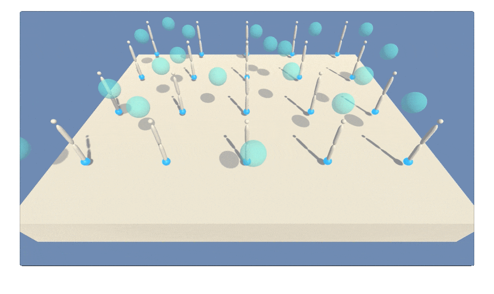

# Deep Reinforcement Learning for Continuous Control

Train an agent to control a robotic arm to continuously track a moving target in the Reacher environment from Unity ML-Agents using a multi-step variant of twin delayed deep deterministic policy gradients (TD3 / DDPG). 

Watch a full video of the agent here: [https://youtu.be/JC9iwMmjpzo](https://youtu.be/JC9iwMmjpzo)



## The  Environment

The Reacher environment in Unity ML-Agents features a double-jointed rigid body arm for tracking a target moving continuously at fast or slow speeds. The agent receives reward points every time step the arm is within the target region. This particular version of the Reacher environment includes 20 robotic arm agents operating at once. Multiple parallel agents can speed up learning. The criteria for solving the task is averaging a score of 30 points across 100 episodes. 

## Installation

1. Create and activate a  Python 3.6 environment. Choose an environment name in place of `my_env`.
```bash
conda create -n my_env python=3.6
source activate my_env
```

2. Create an IPython kernel for your new environment.
```bash
python -m ipykernel install --user --name my_env --display-name "my_env"
```

3. Clone this repository and install dependencies in the `python/` folder, which comes from the [Udacity Deep Reinforcement Learning](https://github.com/udacity/deep-reinforcement-learning) repository. These dependencies will include PyTorch and Unity ML-Agents Toolkit.
```bash
git clone https://github.com/supercurious/deep-rl-continuous-control.git
cd python
pip install .
```

4. Download the Unity environment and unzip the file.
    * [Mac OSX](https://s3-us-west-1.amazonaws.com/udacity-drlnd/P2/Reacher/Reacher.app.zip)
    * [Linux (headless version for training on AWS)](https://s3-us-west-1.amazonaws.com/udacity-drlnd/P2/Reacher/Reacher_Linux_NoVis.zip)
    * [Linux](https://s3-us-west-1.amazonaws.com/udacity-drlnd/P2/Reacher/Reacher_Linux.zip)
    * [Windows (32-bit)](https://s3-us-west-1.amazonaws.com/udacity-drlnd/P2/Reacher/Reacher_Windows_x86.zip)
    * [Windows (64-bit)](https://s3-us-west-1.amazonaws.com/udacity-drlnd/P2/Reacher/Reacher_Windows_x86_64.zip)

## Usage

1. Open the Jupyter notebook `REPORT.ipynb` for implementation and results.
```bash
jupyter notebook REPORT.ipynb
```

2. From the top menu bar, click on "Kernel", navigate to "Change kernel" and select the new environment you created during installation.